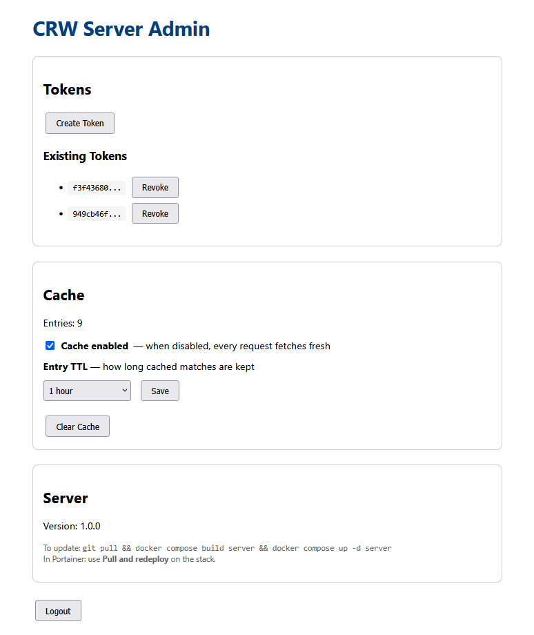
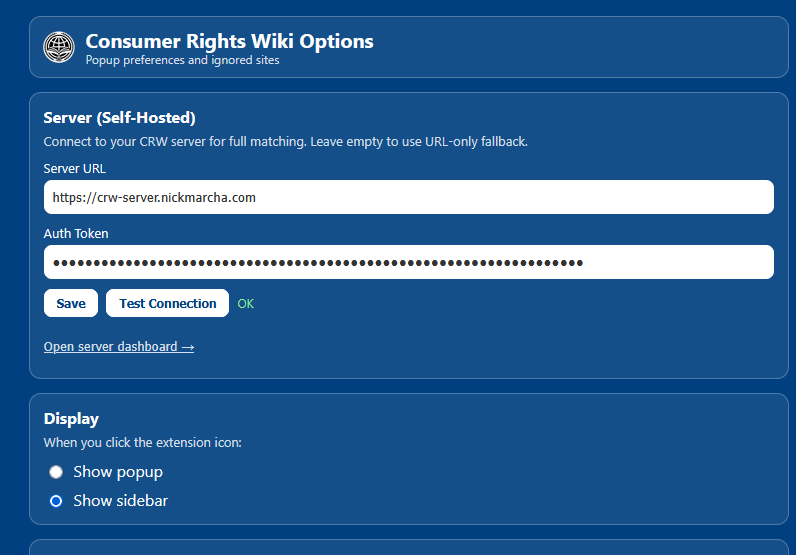
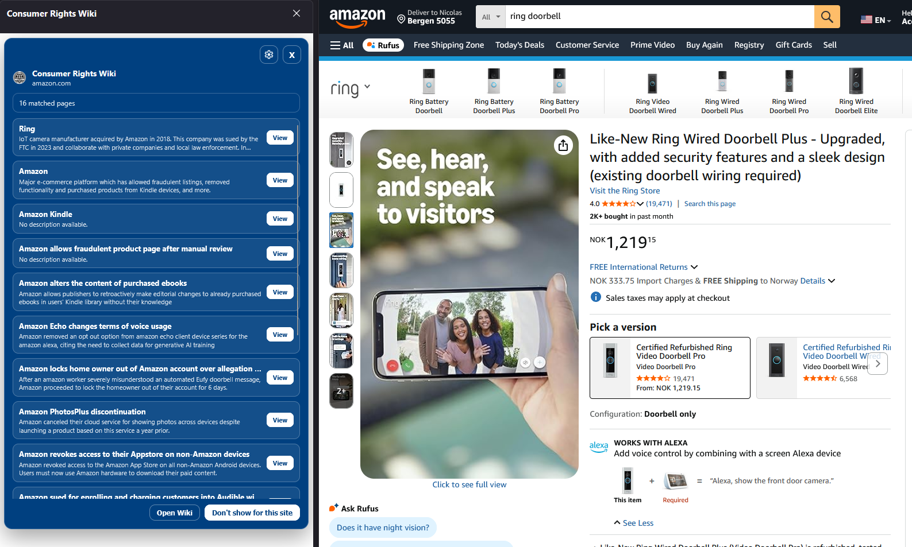

# CRW-Extension (Self-Hosted Fork)

A fork of the [Consumer Rights Wiki extension](https://github.com/FULU-Foundation/CRW-Extension) that reduces permissions and keeps page content reading on your own infrastructure.

## Goals

- **Minimal permissions** — No "Access your data for all websites". The extension only needs `tabs`, `storage`, and optional access to your self-hosted server.
- **No page content reading** — A server you control fetches and renders pages with Puppeteer. The extension never reads DOM, forms, or page content.
- **No auto popup** — Click the extension icon to see matches. Badge shows the count.
- **Firefox sidebar option** — Use the sidebar instead of the popup (Firefox only).
- **URL-only fallback** — When the server is unavailable, the extension falls back to URL matching only (no product-page matching).

## Original Extension

This project is a fork of [FULU-Foundation/CRW-Extension](https://github.com/FULU-Foundation/CRW-Extension). The original extension:

- Is available on [Chrome Web Store](https://chromewebstore.google.com/detail/consumer-rights-wiki/bppajinomefndbbmopljhbdfefnefdha) and [Firefox Add-ons](https://addons.mozilla.org/firefox/addon/consumer-rights-wiki/)
- Uses a content script and broader permissions for automatic matching on page load

## Architecture

- **Extension** — Gets tab URL, sends it to your server (or uses URL-only fallback), displays matches in popup/sidebar.
- **Server** — Fetches pages with Puppeteer, extracts metadata, runs matching, caches results. Includes admin UI for tokens and cache settings.

---

## UI Overview

> **Note:** This is currently a proof-of-concept MVP. The UI is functional but basic.

### Admin Panel

The server admin UI (`/admin/`) lets you manage tokens, cache, and view server info:

- **Tokens** — Create API tokens for the extension. Each token can be revoked. Copy a token and paste it into the extension options.
- **Cache** — Enable/disable caching, set entry TTL (how long matches are cached), and clear the cache. When disabled, every request fetches fresh.
- **Server** — Version info and update instructions for Docker and Portainer.



### Extension Options

Configure the extension in the options page (right-click the icon → Options, or open from the popup):

- **Server URL** — Your CRW server URL (e.g. `https://crw-server.example.com` or `http://localhost:3000`).
- **Auth Token** — Paste the token from the admin panel. Use **Test connection** to verify.
- **Display** — Choose popup or sidebar (Firefox only). The sidebar stays open alongside the page.



### Sidebar / Popup

When you click the extension icon, matches appear in a popup or sidebar. Each match shows the wiki entry title, a short description, and a **View** button to open the full article. The badge on the icon shows the match count.



---

## Server Setup (Docker)

### Prerequisites

- Docker and Docker Compose
- Git (to clone the repo)

### 1. Clone and configure

```shell
git clone <this-repo-url>
cd CRW-Extension
```

Create a `.env` file (copy from `.env.example`):

```shell
cp .env.example .env
```

Edit `.env` and set a strong `ADMIN_PASSWORD`:

```env
ADMIN_USERNAME=admin
ADMIN_PASSWORD=your-secure-password
```

### 2. Start the stack

```shell
docker compose up -d
```

The server listens on port 3000 by default. Open the admin UI at **[http://localhost:3000/admin/](http://localhost:3000/admin/)** (or `http://your-server-ip:3000/admin/` if remote).

**Optional:** Set `PORT=3002` in `.env` to use a different host port.

### 3. Create a token

1. Log in with your admin credentials
2. Click **Create Token**
3. Copy the token and paste it into the extension options

### Cloudflare Tunnel (optional)

To expose the server via a Cloudflare Tunnel:

1. Create a tunnel in [Cloudflare Zero Trust](https://one.dash.cloudflare.com/) → Networks → Tunnels
2. Add a public hostname pointing to `http://server:3000`
3. Add to `.env`:
  ```env
   CLOUDFLARE_TUNNEL_TOKEN=your-token-from-dashboard
  ```
4. Run with the tunnel profile:
  ```shell
   docker compose --profile tunnel up -d
  ```
   Without the `--profile tunnel` flag, only the server and Redis start (no cloudflared container).

### Updating the server

Docker does not auto-update. To pull the latest image and restart:

```shell
git pull
docker compose build --no-cache server
docker compose up -d server
```

Or, to rebuild from your local source after pulling:

```shell
git pull
docker compose up -d --build server
```

---

## Portainer Setup

[Portainer](https://www.portainer.io/) provides a web UI for managing Docker. To run the CRW server via Portainer:

### Option A: Deploy from Git (recommended)

1. In Portainer, go to **Stacks** → **Add stack**
2. Name it `crw-server`
3. Under **Build method**, choose **Git repository**
4. Repository URL: your fork’s clone URL (e.g. `https://github.com/your-user/CRW-Extension.git`)
5. Compose path: `docker-compose.yml`
6. Add environment variables:
  - `ADMIN_USERNAME` = `admin` (or your choice)
  - `ADMIN_PASSWORD` = your secure password
7. Deploy the stack

### Option B: Deploy from upload

1. Clone the repo locally and create your `.env`
2. In Portainer, **Stacks** → **Add stack**
3. Choose **Web editor**
4. Paste the contents of `docker-compose.yml`
5. Under **Environment variables**, add `ADMIN_USERNAME` and `ADMIN_PASSWORD`
6. Deploy

### Portainer: Updating the server

1. Go to **Stacks** → select `crw-server`
2. Click **Editor** to change the stack definition, or **Pull and redeploy** if using a Git-based stack
3. For Git stacks: **Pull and redeploy** fetches the latest commit and rebuilds
4. For uploaded stacks: update the stack YAML, then **Update the stack**

### Portainer: Exposing the server

- Ensure port **3000** is published (it is by default in `docker-compose.yml`)
- If behind a reverse proxy, point it to the Docker host on port 3000

---

## Extension Install

This fork is not published to browser stores. Build from source:

```shell
npm ci
npm run build
```

Load the unpacked extension from the `dist` folder:

- **Chrome/Edge/Brave**: `chrome://extensions/` → Enable Developer mode → Load unpacked → select `dist/chrome`
- **Firefox**: `about:debugging#/runtime/this-firefox` → Load Temporary Add-on → select `dist/firefox/manifest.json`

Configure the extension with your server URL and auth token in the options page. Use **Test connection** to verify.

---

## Development

```shell
npm ci
npm run build
# Or: npm run build:watch
```

See [CONTRIBUTING.md](CONTRIBUTING.md) for contribution guidelines.

---

## Troubleshooting

**Port 3000 already in use** — Often a previous server instance. On Windows:

```powershell
netstat -ano | findstr :3000
taskkill /PID <pid> /F
```

Or stop containers first: `docker compose down`

**Invalid token** — Tokens are stored in Redis and persist across restarts. Create a new token in the admin UI and update the extension.

**Multiple compose files** — If you have both `docker-compose.yml` and `docker-compose.yaml`, remove one to avoid warnings: `rm docker-compose.yaml`

---

## Data Source

The extension matches against data from the [Consumer Rights Wiki](https://consumerrights.wiki). You can contribute at the [Cargo completion project](https://consumerrights.wiki/w/Projects:Cargo-complete).

## Disclaimer

The source code is licensed under the MIT License.

All references found by this software are not part of CRW Extension and are provided under **CC BY-SA 4.0** by [consumerrights.wiki](https://consumerrights.wiki).